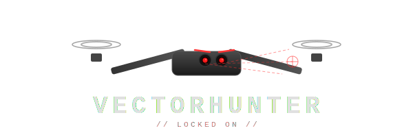

<p align="center">
  <br>
  <strong>Because nobody asked permission before they sent their drones.</strong><br>
  <em>Open-source drone defense simulation. Spot 'em, lock 'em, make 'em regret it.</em>
</p>

<p align="center">
  <a href="#how-to-hunt"></a>
  <a href="#under-the-hood"></a>
  <a href="#tech-stack"></a>
</p>

---

## The Deal

Unmanned invasion threats are real. VectorHunter is our answer — an open-source drone defense simulator where you (or your code) learn to detect, track, and intercept hostile drones in real-time.

No vendor lock-in. No cloud dependency. No permission slips needed.

> Human sovereignty isn't negotiable. We build open-source defense because relying on a corporation for your safety is like hiring a cat to guard the fish.

Built with love for humanity. Long live the people. 🌍

---

## Demo

https://github.com/nerkn/VectorHunter/assets/assets/drone-2026-06-03.mp4

---

## How to Hunt

You're the operator. Invader drones are circling, weaving, and speeding across the sky. Find them. Kill them.

| Key | Action |
|---|---|
| `W A S D` | Chase the sky |
| `Mouse` | Look around like a hawk |
| `1-9` | "I see you." — Lock onto invader drones |
| `J` | "Engage." — Attack mode |
| `K` | "Bang." — Fire |
| `L` | Boost forward |
| `Space / Shift` | Up / Down |
| `Escape` | Pause (nobody judges) |

**Workflow**: Fly → Spot targets labeled 1-9 on screen → Press the number → Drone locks on → Press `J` to approach → Press `K` to fire. Simple. Deadly.

---

## Under the Hood

VectorHunter isn't just a game — it's a full perception pipeline running in your browser:

```
Eyes (Stereo Cameras)
        │
        ▼
   XOR Diff ──► Grayscale difference isolates moving objects
        │
        ▼
┌───────────────────────┐
│   Detection Strategy  │  ← Swap algorithms like plugins
└───────────────────────┘
        │
        ▼
   Tracked Blobs (labeled 1-9)
        │
        ▼
┌───────────────────────┐
│   Flight Director     │  ← Smooth pursuit & targeting
└───────────────────────┘
        │
        ▼
   Drone Control (yaw, pitch, thrust)
```

### Detection Algorithms

Each strategy is pluggable. Mix, match, or write your own:

| Strategy | How it works | Best for |
|---|---|---|
| **BlobTracker** (default) | Find the bright thing. Track it. Classic blob detection with SAD matching. | General purpose, reliable |
| **FlowTracker** | Watch pixels move. Like reading tea leaves, but math. Optical flow-based motion analysis. | Fast-moving targets |
| **HybridTracker** | Blob + Flow. Because why not use both? Combines detection confidence with motion vectors. | Complex scenes |
| **DriftTracker** | Camera shaking? Background moving? Compensates with RANSAC-style background velocity estimation. | Turbulent flights |
| **ShapeTracker** | Is that a drone or a very confident bird? Analyzes blob shape features for classification. | Distinguishing targets |

### Flight Director

Once a target is locked (via `1-9`), the flight director computes pursuit guidance with:
- Predictive lead targeting (where the target *will be*, not where it is)
- Lerp-smoothed yaw/pitch for natural camera movement
- Approach & fire command modes

### Target Behaviors

Invader drones aren't standing still. They come in three flavors:
- **Circle** — Orbiting a fixed point at constant altitude
- **Figure-8** — Lissajous weaving pattern, hard to pin down
- **Line** — High-speed straight passes

---

## Tech Stack

<p>
  
  
  
  
  
  
</p>

- **Frontend**: Vite + React + Three.js (R3F) + TypeScript + Zustand — real-time 3D simulation with stereo rendering
- **Backend**: FastAPI + uvicorn — asset serving & future telemetry
- **Shared**: JSON schemas for cross-boundary type safety

---

## Quick Start

```bash
git clone https://github.com/nerkn/VectorHunter.git
cd VectorHunter

# Frontend
cd frontend
npm install
npm run dev
# Open your browser. Invade it yourself.

# Backend (optional)
cd backend
python -m venv .venv && source .venv/bin/activate
pip install -r requirements.txt
uvicorn main:app --reload --port 8000
```

---

## Structure

```
VectorHunter/
├── frontend/
│   ├── src/
│   │   ├── components/     # 3D scene, drone models, cameras
│   │   ├── hooks/          # Flight controls, input handling
│   │   ├── pipeline/       # Frame processing & detection loop
│   │   ├── store/          # State (drone, targets, detection, flight director)
│   │   ├── strategy/       # Detection algorithms (the brain)
│   │   └── utils/          # Blob tracking, terrain, math
│   └── ...
├── backend/
├── shared/
└── assets/
```

---

## Contributing

Pull requests welcome. Found a better tracking algorithm? A new target behavior? A flight director improvement? Send it.

This is open-source defense. The more brains on this, the harder it gets for anyone to violate sovereignty.

---

## License

MIT — because defense tech should be free.

---

<p align="center">
  <strong>Build defense, not walls.</strong><br>
  <em>VectorHunter — Long live humanity.</em>
</p>
